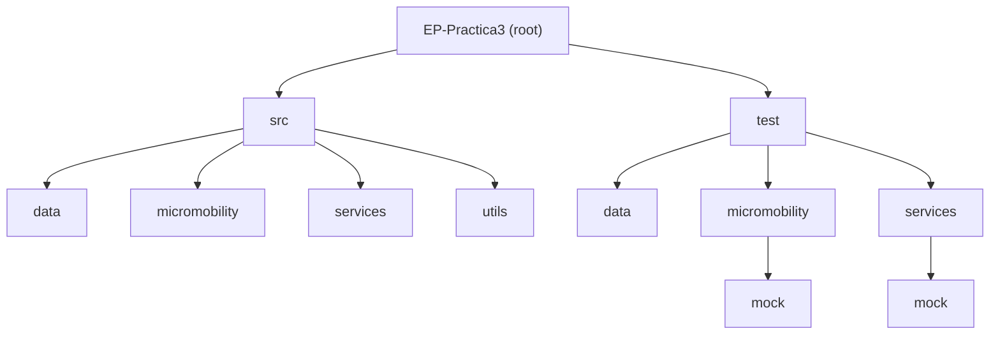

# EP Practica 3

## _Diseño y Pruebas Unitarias · Sistema de Micromobilidad Compartida_

### Description

This project is the third iteration of a micromobilty system. This iteration is centered to implement some
functionalities of the system in Java.
To ensure the compliance of the requirements, the project is developed using double testing via JUnit.

The package structure diagram is the following:

### Authors

- [Serrano Ortega, Aniol](https://github.com/Aniol0012)
- [Boulhani Zanzan, Hamza](https://github.com/Jamshaa)
- [Sànchez Hidalgo, Carles](https://github.com/carless7)
